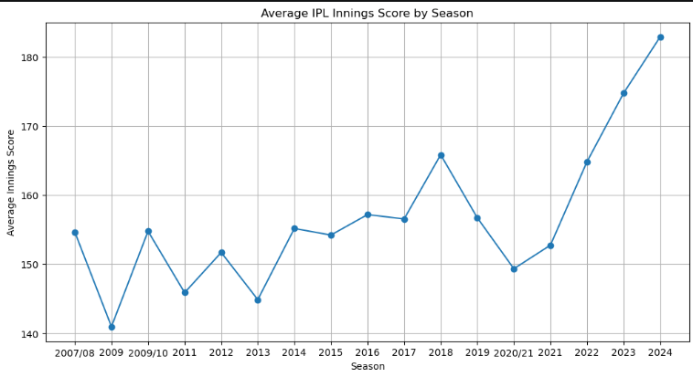
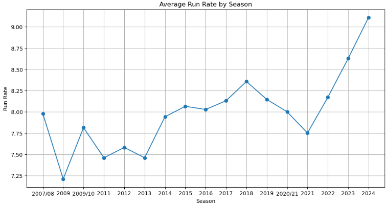
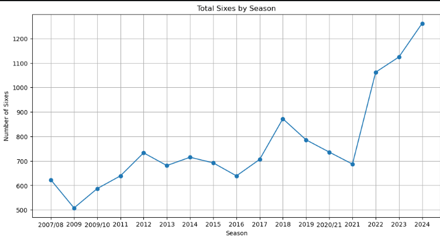
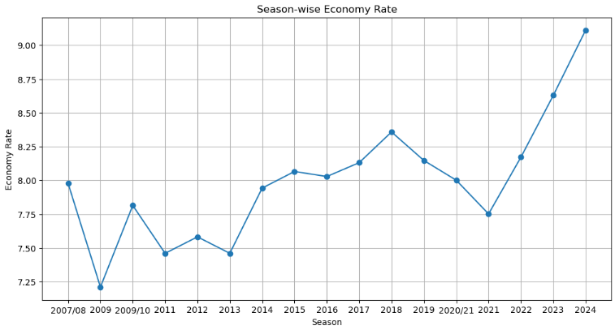

# IPL Batter-Friendliness Analysis (2008–2025)

## Project Overview

This project analyzes whether the **Indian Premier League (IPL)** has become increasingly **batting-friendly from 2008 to 2025**.

Using ball-by-ball match data, the study evaluates long-term trends in **scoring patterns, strike rates, boundary frequency, bowling effectiveness, and match outcomes** to determine structural shifts in T20 cricket.

The goal is to quantify whether modern IPL conditions statistically favor batters compared to earlier seasons.

# Objectives

- Analyze how IPL scoring patterns have evolved over time  
- Measure changes in batting dominance using statistical indicators  
- Evaluate decline or improvement in bowling effectiveness  
- Identify venues that favor high-scoring matches  
- Build a composite metric: **Batter Friendliness Index (BFI)**  
- Create an interactive dashboard for insight communication  

## Research Questions

- Has average innings score increased over time?  
- Are teams scoring at higher run rates in recent seasons?  
- Is six-hitting frequency increasing?  
- Has bowling economy worsened over time?  
- Are 200+ totals becoming more common?  
- Which venues are the most batting-friendly?  

# Dataset

`matches.csv`

Contains match-level information:
- Season  
- Venue  
- Teams  
- Match result  
- Winner  

 `deliveries.csv`

Ball-by-ball dataset:
- Runs per ball  
- Extras  
- Wickets  
- Boundary events  
- Over and ball number  

Source: Kaggle IPL Dataset  

## Tools & Technologies

- Python (Data Analysis)  
- Pandas, NumPy (Data Processing)  
- Matplotlib, Seaborn (Visualization)  
- Power BI (Dashboarding)  
- Jupyter Notebook (EDA Workflow)  

## Methodology

## 1. Data Cleaning & Preparation
- Removed unnecessary columns  
- Handled missing values  
- Standardized season formats  
- Merged match and delivery datasets  

## 2. Feature Engineering

Derived metrics:
- Average innings score per season  
- Run rate per season  
- Sixes per season  
- Bowling economy rate per season  
- Count of 200+ totals  
- Venue-wise average scores  

## 3. Batter Friendliness Index (BFI)

A custom composite index was created using:

- Normalized average innings score  
- Run rate  
- Six-hitting frequency  
- Inverse bowling economy rate  

All features were scaled using **Min-Max normalization** and combined into a single index to measure batting dominance over time.

# Dashboard (Power BI)

## Page 1: IPL Scoring Trends
- KPI Cards (Avg Score, Run Rate, Economy Rate)  
- Season-wise scoring trend  
- Batter Friendliness Index (BFI) trend  

## Page 2: Power Hitting & Venue Analysis
- Sixes trend over seasons  
- 200+ score frequency trend  
- Top batting-friendly venues  

# Key Insights

- Average innings scores have increased significantly over time  
- Run rates show a strong upward trend  
- Six-hitting frequency has increased sharply in modern IPL  
- Bowling economy rates have risen, indicating higher scoring pressure  
- 200+ totals are now significantly more frequent  
- Batter Friendliness Index (BFI) shows a consistent upward trend  

# Conclusion

The analysis provides strong statistical evidence that the **IPL has become increasingly batting-friendly from 2008 to 2025**.

Modern IPL conditions strongly favor batting performance, as shown by:

- Higher scoring rates  
- Increased boundary frequency  
- More frequent high totals  
- Declining bowling effectiveness  

## Key Visualizations

  Average IPL Innings Score by Season

 
  Average Run Rate by Season

    
  Total Sixes by Season

   Season-wise Economy Rate

